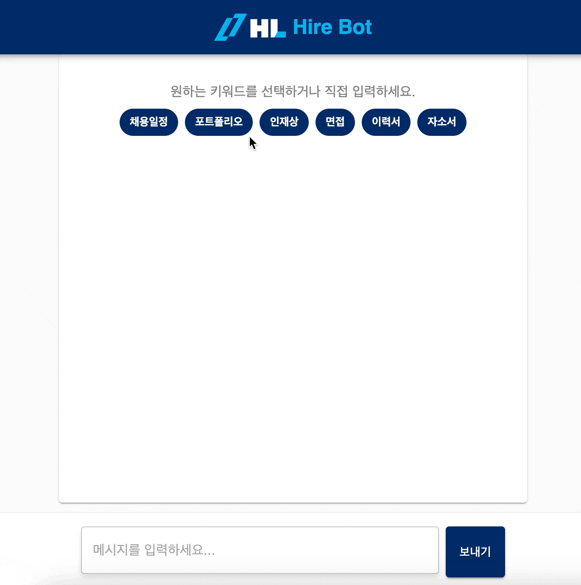

# Hirebot

HL홀딩스 채용 전문가 AI 챗봇

> React 프론트엔드 + Flask 백엔드 기반의 AI 채용 챗봇



---

## 📁 프로젝트 구조

```
Hirebot/
├── holdingsFE/   # React 프론트엔드
└── holdingsBE/   # Flask 백엔드
```

---

## 🌟 기술 스택

- **프론트엔드:** React, Vite, MUI
- **백엔드:** Python, Flask, Gunicorn, OpenAI API
- **배포:** Google Cloud Run, Firebase Hosting

---

## 🚀 프로젝트 실행 방법

### 1️⃣ 프론트엔드 실행

```bash
cd holdingsFE
npm install
npm run dev
```

### 2️⃣ 백엔드 실행

```bash
cd holdingsBE

# 가상환경 설정
python -m venv venv
source venv/bin/activate

# 의존성 설치
pip install -r requirements.txt

# 환경변수 설정 (.env)
OPENAI_API_KEY=your_openai_key

# 로컬 서버 실행
flask run
```

---

## 🐳 Docker 배포하기

### Docker 이미지 빌드

```bash
docker build -t asia.gcr.io/{PROJECT_ID}/flask-hirebot:latest .
docker push asia.gcr.io/{PROJECT_ID}/flask-hirebot:latest
```

### Cloud Run에 배포

```bash
gcloud run deploy flask-hirebot \
  --image asia.gcr.io/{PROJECT_ID}/flask-hirebot:latest \
  --platform managed \
  --region asia-northeast3 \
  --allow-unauthenticated \
  --port 8080
```

---

## 🎯 앞으로의 계획

- 프롬프트 엔지니어링으로 챗봇 성능 및 정확도 개선 작업

---
